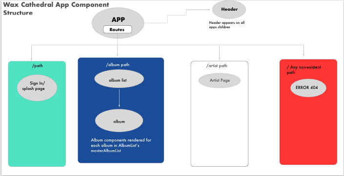

## Wax-Cathedral-React
by

#### Elliot Burin
eburin2@gmail.com

## Description

Todays project was to map out our capstone's component structure which also included implementing what we learned in our week three React course into our capstone project.  The subject matter contained inline object CSS styling, creating modular components, and creating PropTypes that define data types for all component props.

## Screenshot

## Technologies Used

- React
- node package manager
- Chrome
- Sketch

## Installation

To install all packages to be able to run the website, you must:

-clone repository from https://github.com/eburin2/wax-cathedral-react

-navigate to the project's directory in your terminal.

-run the command npm install

-run the command npm run start

-if you wish to see the web page type http://localhost:8080/ in the browser.
